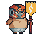

#### Blobert Designs

**Grouped by Type**

    
👇Normie Bloberts 👇

    

        <table>
            <tr>
                <th>Name</th>
                <th>Pic</th>
                <th>Type 1</th>
                <th>Type 2</th>
                <th>Description</th>
                <th>Move 1 </th>
                <th>Move 2 </th>
                <th>Move 3 </th>
                <th>Move 4 </th>
            </tr>
            <tr>
                <td>NonBelieb-Bert</td>
                <td></td>
                <td>Normie</td>
                <td>None</td>
                <td>Does not believe in blockchain or crypto. Hates all things crypto.</td>
                <td>Buy Gold</td>
                <td>Calls Gensler</td>
                <td>Block Crypto Game</td>
                <td>Crypto hurst the environment.</td>
            </tr>
            <tr>
                <td>Furry-Bert</td>
                <td></td>
                <td>NORMIE</td>
                <td>NFT-COLLECTOR</td>
                <td>Identify as a Furry. Did not welcome notion of crypto in bullrun period of 2020-2021. Believes there are environmental issues with crytpo tech. Believe that games should not have crypto or blockchain tech in them. Believe that NFTs are theft on Artists and wastes energy. Have sinced warmed up to Crypto.</td>
                <td>Block Crypto Game</td>
                <td>Buy NFTs</td>
                <td>Write Crypto Blog Post</td>
                <td>Crypto hurst the environment.</td>
            </tr>
            <tr>
                <td>Confused-Bert</td>
                <td></td>
                <td>Normie</td>
                <td>None</td>
                <td>Constantly confused with the stream of information/misinformation in the news</td>
                <td>Buy Gold</td>
                <td>Worships Crazy Presidents</td>
                <td>Watch TikTok Investments</td>
                <td>Crypto is a Skem!</td>
            </tr>
            <tr>
                <td>Confused-Bert</td>
                <td></td>
                <td>Normie</td>
                <td>Degen-Tradoor</td>
                <td>Does not have an opinion. Follows whoever sounds right</td>
                <td>Buy Gold</td>
                <td>Copys Cramer</td>
                <td>Copys Nancy</td>
                <td>Buys NFT Rocks</td>
            </tr>
        </table>
    

    
👇NFT-Collectoor Bloberts 👇

    

        <table>
            <tr>
                <th>Name</th>
                <th>Pic</th>
                <th>Type 1</th>
                <th>Type 2</th>
                <th>Description</th>
                <th>Move 1 </th>
                <th>Move 2 </th>
                <th>Move 3 </th>
                <th>Move 4 </th>
            </tr>
            <tr>
                <td>Pudgy-Bert</td>
                <td></td>
                <td>NFT-COLLECTOOR</td>
                <td>INFLUENZA</td>
                <td>Feels super attached to their NFTs. The NFT defines them. Beliebs the NFT gibs protection</td>
                <td>Buys Premium NFT</td>
                <td>Camps for Whitelist</td>
                <td>Tweets: I am my pengu</td>
                <td>Panels in X spaces</td>
            </tr>
            <tr>
                <td>Kevin-Bert</td>
                <td></td>
                <td>NORMIE</td>
                <td>NFT-COLLECTOR</td>
                <td>Followed the trend of NFT buying. Bought into "based" project. Project not as expected</td>
                <td>Buys Premium NFT</td>
                <td>Camps for Whitelist</td>
                <td>Adds NFT PFP</td>
                <td>Tweets NFT conviction</td>
            </tr>
            <tr>
                <td>Milady-Bert</td>
                <td></td>
                <td>NFT-COLLECTOR</td>
                <td>Meme</td>
                <td></td>
                <td>Buys NFT Floor</td>
                <td>Tweets Controversial Remarks</td>
                <td>Tweets: There is no meme, I love u</td>
                <td>~Milady Remilia Rave~</td>
            </tr>
            <tr>
                <td>Duck-Bert</td>
                <td></td>
                <td>NFT-Collectoor</td>
                <td>INFLUENZA</td>
                <td>COllects NFTs more aligned to Chain & Ecosystem</td>
                <td>Issues Based NFT Merch</td>
                <td>Copys Cramer</td>
                <td>Tweets Ecosystem conviction</td>
                <td>Panels in X spaces</td>
            </tr>
        </table>
    

    
👇Influenza Bloberts 👇

    

        <table>
            <tr>
                <th>Name</th>
                <th>Pic</th>
                <th>Type 1</th>
                <th>Type 2</th>
                <th>Description</th>
                <th>Move 1 </th>
                <th>Move 2 </th>
                <th>Move 3 </th>
                <th>Move 4 </th>
            </tr>
            <tr>
                <td>NFT-INFLUENZA-BERT</td>
                <td></td>
                <td>INFLUENZA</td>
                <td>NFT-COLLECTOOR</td>
                <td>Shills NFT for a living. Ties with projects that might give them whitelist or shill-gig.</td>
                <td>Writes NFT investment thesis</td>
                <td>Shares whitelisting dates</td>
                <td>Dumps on NFT Reveal</td>
                <td>Panels in X spaces</td>
            </tr>
            <tr>
                <td>AIRDROP-INFLUENZA-BERT</td>
                <td></td>
                <td>INFLUENZA</td>
                <td>DEFI</td>
                <td>Basically churns airdrops and sybils chain usuage metrics to farm.</td>
                <td>Dumps on unlock</td>
                <td>Sybil many wallets and nodes</td>
                <td>Shares Airdrop List</td>
                <td>Anger Tweet on low rewards</td>
            </tr>
            <tr>
                <td>MEME-INFLUENZA-BERT</td>
                <td></td>
                <td>INFLUENZA</td>
                <td>MEME</td>
                <td>Identifies the essential memes that define the cultural moment and shills to public for pumps.</td>
                <td>Longs coin before shill</td>
                <td>Creates viral meme video</td>
                <td>Tweets viral slogan</td>
                <td>Dumps on Followers</td>
            </tr>
            <tr>
                <td>GAMEINFLUENZA-BERT</td>
                <td></td>
                <td>INFLUENZA</td>
                <td>GAMER</td>
                <td>Deeply beliebs in on-chain games. Shills via game videos and challenges.</td>
                <td>Streams own game on Twitch</td>
                <td>Adds GAME PFP to self</td>
                <td>Tweets Ecosystem conviction</td>
                <td>Panels in X spaces</td>
            </tr>
        </table>
    

